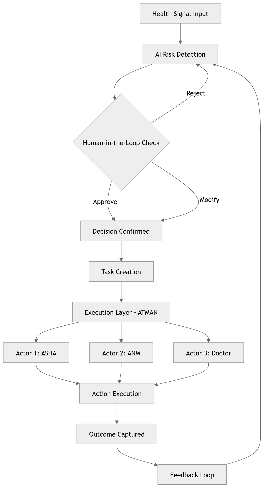

# ATMAN Health OS  
### Human-in-the-Loop (HITL) + Execution Architecture

---

## Overview

Healthcare systems today can detect risk.

But they consistently fail to act on it.

> Healthcare doesn’t fail because it lacks capability.  
> It fails because it lacks execution.

Across hospitals, public health programs, and digital systems, early signals are increasingly captured — yet those signals often fail to translate into timely, coordinated action.

By the time systems respond, intervention becomes reactive, complex, and costly.

ATMAN Health OS is designed as an **execution layer** —  
ensuring that signals translate into timely, coordinated, and accountable action across the system.

---

## Core Insight

AI can detect.  
Humans can decide.  

But healthcare systems fail when **execution breaks**.

> Most systems stop at decision.  
> ATMAN ensures decisions translate into action.

---

## System Flow

Signal → AI Detection → Human Validation → Execution → Outcome → Feedback

This is not a linear pipeline.

It is a **closed-loop execution system** where outcomes continuously influence future decisions.

This flow represents a closed-loop system — not a one-time decision pipeline.

This is how reliable systems operate under complexity — not as isolated decisions, but as continuously coordinated actions.
---

## Architecture Diagram

This diagram illustrates how decision-making is extended into execution across multiple actors — ensuring continuity from signal to outcome.

--- ## What This Diagram Represents

This architecture shows how healthcare moves from:

Detection → Decision → Execution → Outcome

Key difference:

- Traditional systems stop at decision  
- ATMAN ensures execution happens across multiple actors  

Human-in-the-loop ensures decisions are correct.  
ATMAN ensures decisions are carried out.

## What This Architecture Enables

- Reliable conversion of signals into action  
- Human-validated decision making (HITL)  
- Coordinated execution across multiple actors  
- Closed-loop outcome tracking  
- Continuous system learning  

---

## Why This Matters

Most health systems optimise:

- detection  
- decision  

ATMAN focuses on what happens after:

- execution  
- accountability  
- continuity  

Because outcomes do not depend on what systems know —  
they depend on what systems actually do.

---

## Positioning

ATMAN is not:

- a hospital system  
- a diagnostic tool  
- a standalone AI product  

ATMAN is:

👉 **An execution layer that ensures decisions translate into coordinated action across the system**

**Designed to operate reliably even in real-world variability — across multiple actors, dependencies, and constraints**

## What Makes This Different

- Not another AI layer  
- Not another dashboard  
- Not another workflow tool  

👉 A system designed to ensure that decisions are executed — consistently and reliably

Because outcomes are not driven by intelligence alone —  
they are driven by reliable execution.

This is not an optimisation layer.

It is a structural layer for system reliability.
---

## Key Principle

> Execution is not assumed.  
> It is managed.
>
> ## The Deeper Shift

Healthcare does not need more intelligence layers.

It needs systems that can execute reliably across complexity.

That is the shift ATMAN represents.

Systems don’t change when they become smarter.

They change when they become reliable.

>## Final Thought

Healthcare systems don’t fail because they lack intelligence.

They fail because they cannot execute reliably at scale.

ATMAN is designed to change that.
> 
