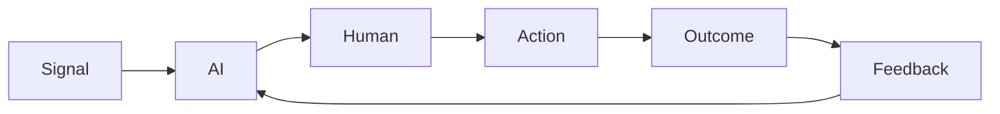
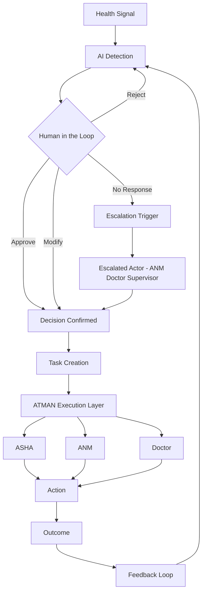

## System Flow

Signal → AI Detection → Human Validation → Execution → Outcome → Feedback

This is not a linear pipeline.

It is a **closed-loop execution system** where outcomes continuously influence future decisions.

---

### Simple Execution Loop

---

### Visual Flow Representation

